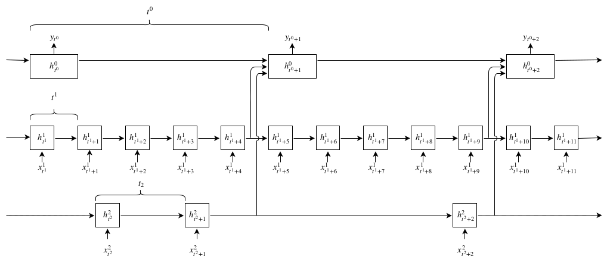

# LSTM Continuous Turn-Taking Prediction

Pytorch implementation for two papers:

1. Multimodal Continuous Turn-Taking Prediction Using Multiscale RNNs (ICMI '18)
2. [Investigating Speech Features for Continuous Turn-Taking Prediction
Using LSTMs](https://arxiv.org/pdf/1806.11461.pdf) (INTERSPEECH '18)

<p align="center"></p>


The supplied code is designed to reproduce the main results from [1] that show the utility of using the multiscale approach. The code can potentially be adapted to reproduce other results from both papers. It can also be used to investigate other user-defined feature-sets and architectures. I hope it is useful! Feel free to contact me if you find any errors or have any queries. Please note that it is still a work in progress.

## Requirements: 

- Linux
- PyTorch v>0.3.0
- Anaconda 
- Sox 
- OpenSmile-2.3.0

## Setup

Download the repository.
 ```bash
git clone https://github.com/mattroddy/lstm_turn_taking_prediction 
```
Download the maptask corpus audio data from (http://groups.inf.ed.ac.uk/maptask/maptasknxt.html) by running the wget.sh script obtained from the site. Run the script from within the lstm_turn_taking_prediction/data/ folder:
 ```bash
cd lstm_turn_taking_prediction/data
sh 'maptaskBuild-xxxxx.wget.sh'
wget http://groups.inf.ed.ac.uk/maptask/hcrcmaptask.nxtformatv2-1.zip
unzip hcrcmaptask.nxtformatv2-1.zip
rm hcrcmaptask.nxtformatv2-1.zip
cd ..
```
Split the audio channels:
 ```bash
bash scripts/split_channels.sh
```

Download opensmile from (https://audeering.com/technology/opensmile/#download) and extract into lstm_turn_taking_prediction/utils. Then replace config files with modified ones: (note: config files have been modified to use a 50ms step size, not use smoothing, and adopt the left-alignment convention)
 ```bash
rm -r utils/opensmile-2.3.0/config
mv -r utils/config /utils/opensmile-2.3.0/
```

Extract gemaps features and voice activity annotations:
```bash
python scripts/extract_gemaps.py
python scripts/prepare_gemaps.py
python scripts/get_VA_annotations.py
python scripts/get_word_annotations.py
python scripts/prepare_fast_data_ling.py
```

Extract evaluation metric datasets
```bash
python scripts/find_pauses.py
python scripts/find_overlaps.py
python scripts/find_onsets.py
```

## Running the code

At this point a model can be trained and tested by running:
```bash
python run_json.py 
```

To reproduce the main results in [1] set the path to your python environment in the icmi_18_results.py file. Then: 
```bash
python icmi_18_results.py 
```
This will reproduce the following rows from Table 1: 1,2,4,5,11,13. This should take several hours on a modern computer with a GTX1080 GPU.


